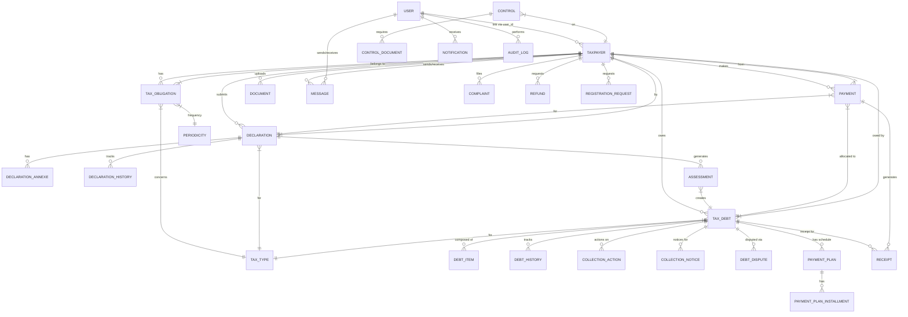

# MNK-TAX — Documentation des Données Fictives (Demo Data Seeder)

> **Source** : `backend/src/main/java/com/mnktax/common/config/DemoDataSeeder.java` (2016 lignes)
> **Activation** : `mnk-tax.seed-demo=true` (défaut dev) — désactivable via `SEED_DEMO=false` ou profil `test`.
> **Production** : désactivé par défaut (`application-prod.yml` → `SEED_DEMO:false`) — activer explicitement `SEED_DEMO=true` pour charger la démo.
> **Compagnon JSON** : `docs/fake-data-seed.json` (mêmes données, format programmatique).
> **Idempotence** : le seeder s'ignore si des utilisateurs existent déjà (`userRepository.count() > 0`).

---

## 1. Utilisateurs Système (6 comptes)

| Username | Email | Rôle | Mot de passe | Description |
|----------|-------|------|--------------|-------------|
| `superadmin` | superadmin@mnk-tax.mg | SUPER_ADMIN | Admin@123 | Super administrateur |
| `admin` | admin@mnk-tax.mg | ADMIN | Admin@123 | Administrateur |
| `agent.tax` | agent.tax@mnk-tax.mg | TAX_AGENT | Agent@123 | Agent fiscal |
| `agent.collection` | agent.collection@mnk-tax.mg | COLLECTION_AGENT | Agent@123 | Agent recouvrement |
| `accountant` | accountant@mnk-tax.mg | ACCOUNTANT | Agent@123 | Comptable |
| `taxpayer.demo` | taxpayer@mnk-tax.mg | TAXPAYER | Taxpayer@123 | Contribuable démo |

> **Permissions** : Voir `seedPermissions()` (89 permissions) et `seedRoles()` (5 rôles avec mappings)

---

## 2. Référentiels Fiscaux

### 2.1 Centres Fiscaux (3)
| Code | Nom | Adresse |
|------|-----|---------|
| CEN-001 | Centre fiscal Analakely | Antananarivo, Analakely |
| CEN-002 | Centre fiscal Antanimena | Antananarivo, Antanimena |
| CEN-003 | Centre fiscal Toamasina | Toamasina |

### 2.2 Régimes Fiscaux (3)
| Code | Nom | Catégorie | TVA | Périodicité | Types d'impôts |
|------|-----|-----------|-----|-------------|----------------|
| REG-REEL | Régime réel | REEL | Oui | MONTHLY | TVA,IS,IRSA |
| REG-SIMP | Régime simplifié | SIMPLIFIE | Oui | QUARTERLY | TVA,IRSA |
| REG-FORF | Régime forfaitaire | FORFAITAIRE | Non | ANNUAL | IFT |

### 2.3 Types d'Impôts (9)
| Code | Nom | Catégorie |
|------|-----|-----------|
| IR | Impôt sur les Revenus | IMPOSITION |
| IS | Impôt sur les Sociétés | IMPOSITION |
| IRSA | Impôt sur les Revenus Salariaux | IMPOSITION |
| TVA | Taxe sur la Valeur Ajoutée | IMPOSITION |
| IPVI | Impôt sur les Plus-Values Immobilières | IMPOSITION |
| DE | Droit d'Enregistrement | IMPOSITION |
| DA | Droit d'Accises | IMPOSITION |
| IFT | Impôt Foncier sur les Terrains | IMPOSITION |
| IFPB | Impôt Foncier sur les Propriétés Bâties | IMPOSITION |

### 2.4 Règles Fiscales (6, toutes `demo=true`)
| Code | Nom | Type | Méthode | Taux | Contribuable | Régime | Ref légale |
|------|-----|------|---------|------|--------------|--------|------------|
| R-TVA-20 | TVA taux unique | TVA | PERCENTAGE_OF_BASE | 20% | COMPANY | REG-REEL | Règle de calcul de référence |
| R-IS-25 | IS taux | IS | PERCENTAGE_OF_BASE | 25% | COMPANY | REG-REEL | Règle de calcul de référence |
| R-IRSA-15 | IRSA taux | IRSA | PERCENTAGE_OF_BASE | 15% | PERSON | — | Règle de calcul de référence |
| R-IR-20 | IR taux | IR | PROGRESSIVE | 20% | — | — | Règle de calcul de référence |
| R-IFT-2 | IFT taux | IFT | PERCENTAGE_OF_BASE | 2% | — | — | Règle de calcul de référence |

### 2.5 Pénalités & Intérêts
| Code | Nom | Taux | Périodicité |
|------|-----|------|-------------|
| PEN_DEMO_5 | Pénalité de retard 5% | 5% | — |
| INT_DEMO_1 | Intérêt de retard 1%/mois | 1% | MONTHLY |

### 2.6 Échéances (générées pour l'année courante)
- **TVA** : mensuelle, déclaration J+20, paiement J+25
- **IRSA** : mensuelle, déclaration J+20, paiement J+25
- **IS** : annuelle, déclaration 31 mars N+1, paiement 15 avril N+1

---

## 3. Contribuables (5)

| NIF | Nom | Type | Centre | Régime | Email | Téléphone | Adresse | Représentant | Naissance | Activité principale |
|-----|-----|------|--------|--------|-------|-----------|---------|--------------|-----------|---------------------|
| `0000409001` | SOCIÉTÉ MALAGASY | COMPANY | CEN-001 | REG-REEL | contact@mnk-tax.mg | 036 00 000 01 | Antananarivo, Lot II 123 | Rakotoarison Hery | — | 4771 Commerce de détail |
| `1234567890` | Jean RAKOTO | PERSON | CEN-001 | REG-SIMP | jean.rakoto@mnk-tax.mg | 033 00 000 02 | Antananarivo | — | 1985-06-15 | 8510 Activités libérales |
| `9876543210` | ENTREPRISE SARL | COMPANY | CEN-002 | REG-SIMP | contact@mnk-tax.mg | 034 00 000 03 | Antananarivo, rue des Manguiers 45 | Andriamihaja Lova | — | 5610 Restauration |
| `0000412345` | TRANSPORT SA | COMPANY | CEN-003 | REG-REEL | transport@mnk-tax.mg | 032 00 000 04 | Toamasina | Rasolofonirina Mamy | — | 4931 Transports urbains |
| `1000000001` | Marie RANDRIANARISOA | PERSON | CEN-001 | REG-SIMP | marie.randrianarisoa@mnk-tax.mg | 038 00 000 05 | Antananarivo | — | 1990-11-02 | 6810 Activités immobilières |

> **Liaison User** : `taxpayer.demo` (user_id) ↔ NIF `1234567890` et `1000000001`

---

## 4. Obligations Fiscales par Contribuable

| Contribuable | Type Impôt | Périodicité | Début | Statut Déclaration | Statut Paiement |
|--------------|------------|-------------|-------|-------------------|-----------------|
| TP1 (0000409001) | TVA | MONTHLY | -1 an | NOT_SUBMITTED | UNPAID |
| TP1 | IS | ANNUAL | -1 an | NOT_SUBMITTED | UNPAID |
| TP1 | IFPB | SEMI_ANNUAL | -1 an | NOT_SUBMITTED | UNPAID |
| TP2 (1234567890) | IRSA | MONTHLY | -1 an | NOT_SUBMITTED | UNPAID |
| TP3 (9876543210) | TVA | MONTHLY | -1 an | NOT_SUBMITTED | UNPAID |
| TP3 | IFT | SEMI_ANNUAL | -1 an | NOT_SUBMITTED | UNPAID |
| TP4 (0000412345) | TVA | MONTHLY | -1 an | NOT_SUBMITTED | UNPAID |
| TP4 | IS | ANNUAL | -1 an | NOT_SUBMITTED | UNPAID |
| TP5 (1000000001) | IFPB | ANNUAL | -1 an | NOT_SUBMITTED | UNPAID |

---

## 5. Déclarations & Transactions (seedTransactions)

### 5.1 Déclarations Créées

| Contribuable | Impôt | Période | Base | Déclaré | Statut | Description |
|--------------|-------|---------|------|---------|--------|-------------|
| TP1 | TVA | Mois courant | 1 000 000 | 200 000 | VALIDÉE | Déclaration récente → assessment → créance |
| TP1 | TVA | M-5 | 1 500 000 | 300 000 | VALIDÉE | En retard → créance OVERDUE |
| TP2 | IRSA | Mois courant | 400 000 | 60 000 | SOUMISE | En attente validation |
| TP3 | TVA | M-1 | 750 000 | 150 000 | BROUILLON | Non soumise |

### 5.2 Paiements Enregistrés

| Cas | Contribuable | Créance | Montant | Date | Méthode | Ref | Statut |
|-----|--------------|---------|---------|------|---------|-----|--------|
| 1 | TP1 | TVA récente | 50 000 | J-3 | BANK_TRANSFER | TXN-BANK-001 | Confirmé, alloué |
| 2 | TP1 | TVA ancienne | 50 000 | J-2 | CASH | — | Partiellement alloué |
| 3 | TP2 | IRSA | 180 000 | J-1 | MOBILE_MONEY | TXN-MOMO-002 | En attente |
| 5 | TP4 | En recouvrement | 500 000 | J-5 | CARD | TXN-CARD-003 | Créé puis annulé (cas 5) |
| 9 | — | En recouvrement | 200 000 | Aujourd'hui | BANK_TRANSFER | TXN-BANK-009 | Paiement en recouvrement |

### 5.3 Actions de Recouvrement (sur créance OVERDUE TP1)
| Type | Date | Résultat | Responsable |
|------|------|----------|-------------|
| REMINDER | J-10 | En attente de paiement | User 4 |
| PHONE_CONTACT | J-5 | Promesse paiement sous 15 jours | User 4 |

---

## 6. Scénarios de Créances (9 créances — seedDebtScenarios)

| # | Contribuable | Impôt | Date émission | Principal | Payé | Statut | Origine | Priorité | Centre | Observations |
|---|--------------|-------|---------------|-----------|------|--------|---------|----------|--------|--------------|
| 1 | TP1 | TVA | (existante) | — | — | PARTIALLY_PAID | ASSESSMENT | NORMALE | CEN-001 | Déjà partiellement payée |
| 2 | TP1 | TVA | (existante) | — | — | OVERDUE | ASSESSMENT | HIGH | CEN-001 | Retard plusieurs mois |
| 3 | TP4 | TVA | M-3 | 2 500 000 | 1 000 000 | IN_COLLECTION | DECLARATION | URGENT | CEN-003 | Mise en demeure envoyée |
| 4 | TP3 | IFT | M-6 | 450 000 | 0 | DISPUTED | CONTROL | NORMALE | CEN-002 | Contestation contribuable |
| 5 | TP5 | IRSA | M-2 | 780 000 | 0 | SUSPENDED | OTHER | LOW | CEN-001 | Réclamation en cours |
| 6 | TP1 | TVA | M-12 | 350 000 | 0 | CLOSED | AUDIT | NORMALE | CEN-001 | Irrécouvrable, radié |
| 7 | TP2 | IRSA | J-14 | 180 000 | 0 | ISSUED | ASSESSMENT | NORMALE | CEN-001 | Échéance dans 2 semaines |
| 8 | TP3 | TVA | M-1 | 850 000 | 300 000 | PARTIALLY_PAID | DECLARATION | HIGH | CEN-002 | Solde 550 000 |
| 9 | TP4 | IS | M-4 | 5 000 000 | 1 500 000 | OVERDUE | RECOVERY | URGENT | CEN-003 | Saisie administrative risque |

> **Historique** : Chaque créance a des `DebtHistory` (CREATED, PENALTY_APPLIED, INTEREST_APPLIED, STATUS_CHANGE, PAYMENT_RECEIVED, etc.)
> **Items** : `DebtItem` PRINCIPAL + CREDIT (si payé)

---

## 7. Messages (9 threads)

| # | Expéditeur | Destinataire | Sujet | Contexte | Priorité | Statut | Lu |
|---|------------|--------------|-------|----------|----------|--------|-----|
| 1 | Admin | Agent Tax | Bienvenue | GENERAL | NORMAL | WAITING_RESPONSE | Non |
| 2 | Agent Tax | Admin | Vérif déclaration TVA | DECLARATION | NORMAL | RESPONDED | Oui |
| 3 | Admin | Agent Tax | Re: Vérif TVA | DECLARATION | NORMAL | CLOSED | Oui |
| 4 | Agent Coll | Comptable | Créance en retard | DEBT | URGENT | WAITING_RESPONSE | Non |
| 5 | Comptable | Agent Tax | Paiement reçu | PAYMENT | IMPORTANT | WAITING_RESPONSE | Non |
| 6 | Agent Coll | Admin | Action terminée | RECOVERY | NORMAL | ARCHIVED | Oui |
| 7 | Agent Tax | Admin | Contrôle planifié | AUDIT | IMPORTANT | CLOSED | Oui |
| 8 | Admin | Agent Tax | Échéance TVA | DEADLINE | URGENT | WAITING_RESPONSE | Non |
| 9 | Contribuable | Agent Tax | Réclamation montant | COMPLAINT | NORMAL | WAITING_RESPONSE | Non |

---

## 8. Contrôles Fiscaux (2)

| # | Contribuable | Type | Période | Statut | Agent | Redressement | Pénalité | Anomalies |
|---|--------------|------|---------|--------|-------|--------------|----------|-----------|
| 1 | TP1 | MIXED | M-2 → aujourd'hui | IN_PROGRESS | Agent Tax | — | — | Vérification en cours |
| 2 | TP3 | ON_SITE | M-8 → M-6 | REDRESSEMENT | Agent Tax | 450 000 | 22 500 | Sous-déclaration IFT 2 exercices |

**Documents contrôles** : Grand livre comptable (TP1), Bilans et relevés fonciers (TP3)

---

## 9. Notifications (8)

| User | Type | Titre | Entité | Lu |
|------|------|-------|--------|-----|
| Agent Tax | DEADLINE_APPROACHING | Échéance TVA à venir | DEADLINE | Non |
| Admin | PAYMENT_RECEIVED | Paiement reçu — 100 000 MGA | PAYMENT | Oui |
| Agent Coll | OVERDUE | Créance en retard — TRANSPORT SA | DEBT | Non |
| Admin | COLLECTION_NOTICE | Mise en demeure envoyée | COLLECTION | Oui |
| Agent Tax | DOCUMENT_READY | Quittance disponible | RECEIPT | Non |
| Admin | MESSAGE_RECEIVED | Nouveau message — Urgent | MESSAGE | Non |
| Agent Tax | DEADLINE_TODAY | Échéance IRSA aujourd'hui | DEADLINE | Non |
| Admin | PAYMENT_REJECTED | Paiement rejeté — CHQ-001 | PAYMENT | Non |

---

## 10. Audit Logs (10 entrées)

| User | Action | Entité | Ancienne Valeur | Nouvelle Valeur | IP |
|------|--------|--------|-----------------|-----------------|-----|
| admin | CREATE | Taxpayer | — | SOCIÉTÉ MALAGASY | 192.168.1.10 |
| agent.tax | VALIDATE | Declaration | DRAFT | VALIDATED | 192.168.1.15 |
| agent.collection | UPDATE | Debt | OVERDUE | IN_COLLECTION | 192.168.1.20 |
| admin | CREATE | User | — | agent.tax créé | 192.168.1.10 |
| agent.tax | VIEW | Assessment | — | — | 192.168.1.15 |
| agent.collection | COLLECTION_ACTION | Debt | — | Relance enregistrée | 192.168.1.20 |
| admin | UPDATE | SystemParameter | VAT_RATE=18 | VAT_RATE=20 | 192.168.1.10 |
| agent.tax | CREATE | Declaration | — | TVA ENTREPRISE SARL | 192.168.1.15 |
| agent.collection | EXPORT | Debt | — | — | 192.168.1.20 |
| admin | LOGIN | User | — | Connexion réussie | 192.168.1.10 |

---

## 11. Réclamations (3)

| # | Contribuable | Sujet | Contexte | Statut | Assigné | Résolution |
|---|--------------|-------|----------|--------|---------|------------|
| 1 | TP1 | Contestation montant TVA | DECLARATION | UNDER_REVIEW | Agent Tax | — (en cours) |
| 2 | TP3 | Pénalité IFT contestée | DEBT | ACCEPTED | Agent Tax | Pénalité annulée — force majeure |
| 3 | TP5 | Remboursement TVA refusé | REFUND | REJECTED | Agent Tax | Crédit non justifié |

**Réponses** : 2 réponses sur #1, 1 sur #2, 1 sur #3

---

## 12. Remboursements (3)

| # | Contribuable | Motif | Montant | Statut | Demandé par | Approuvé par | Payé le |
|---|--------------|-------|---------|--------|-------------|--------------|---------|
| 1 | TP1 | VAT_CREDIT | 350 000 | UNDER_REVIEW | Agent Tax | Agent Tax | — |
| 2 | TP4 | OVERPAYMENT | 500 000 | PAID | Agent Coll | Admin | J-5 |
| 3 | TP1 | OTHER | 150 000 | REJECTED | Agent Tax | Admin | — |

---

## 13. Mises en Demeure (3)

| # | Créance | N° Notice | Date | Type | Statut | Envoyé le |
|---|---------|-----------|------|------|--------|-----------|
| 1 | IN_COLLECTION (1ère) | MD-2026-0001 | J-20 | MISE_EN_DEMEURE | SENT | J-18 |
| 2 | IN_COLLECTION (1ère) | REL-2026-0001 | J-10 | RELANCE | SENT | J-8 |
| 3 | IN_COLLECTION (2ème) | AV-2026-0001 | J-5 | AVERTISSEMENT | DRAFT | — |

---

## 14. Workflows Recouvrement Avancés (seedCollectionWorkflows)

### 14.1 Litige Documenté
- Créance DISPUTED → `DebtDispute` OPEN, raison : "Contestation base redressée", montant contesté = total

### 14.2 Créance Retard 5 jours (Tableau de bord §54)
- TP2, IRSA, 327 000 MGA, OVERDUE, HIGH
- Relance amiable J-1 (DONE)

### 14.3 Créance Retard 35 jours (Palier 30-60 jours)
- TP1, TVA, 1 250 000 MGA, OVERDUE, URGENT
- Pénalité 62 500 MGA

### 14.4 Échéancier de Paiement (sur créance 35 jours)
| Tranche | Échéance | Montant | Payé | Statut |
|---------|----------|---------|------|--------|
| 1 | J-5 | ~312 500 | 0 | PENDING (ÉCHUE IMPAYÉE → ALERTE) |
| 2 | M+1 | ~312 500 | 0 | PENDING |
| 3 | M+2 | ~312 500 | 0 | PENDING |
| 4 | M+3 | ~312 500 | 0 | PENDING |
> **Total** : 1 250 000 MGA, 4 tranches, référence ECH-xxxx

---

## 15. Documents (4)

| Contribuable | Titre | Type | Chemin | Taille | Uploadé par |
|--------------|-------|------|--------|--------|-------------|
| TP1 | Kbis - SOCIÉTÉ MALAGASY | Kbis | /data/documents/kbis_tp1.pdf | 320 KB | Agent Tax |
| TP1 | Contrat social | CONTRAT | /data/documents/contrat_social_tp1.pdf | 180 KB | Agent Tax |
| TP3 | Patente ENTREPRISE SARL | PATENTE | /data/documents/patente_tp3.pdf | 210 KB | Agent Tax |
| TP4 | Autorisation transport TRANSPORT SA | AUTORISATION | /data/documents/autorisation_tp4.pdf | 150 KB | Agent Tax |

---

## 16. Quittances (6)

| # | Référence | Paiement | Statut | Particularité |
|---|-----------|----------|--------|---------------|
| 1 | REC-DEMO-001 | Paiement complet | ISSUED | — |
| 2 | REC-DEMO-002 | Paiement partiel | ISSUED | — |
| 3 | REC-DEMO-003 | — | CANCELLED | Annulation test |
| 4 | REC-DEMO-004 | — | REPLACED | Remplacée par REC-DEMO-004-BIS |
| 5 | REC-DEMO-005 | — | REFUNDED | Remboursement REM-DEMO-001 |
| 6 | REC-DEMO-006 | — | ISSUED | QR vérifiable |

> Chaque quittance a `verificationToken` (VRF-...) et `receiptNumber` (QU/YYYYMM/XXXXXX)

---

## 17. Demandes d'Inscription (10)

| Réf | Type | Nom | Email | NIF | Rôle | Statut |
|-----|------|-----|-------|-----|------|--------|
| REG-2026-000001 | INDIVIDUAL | RAKOTO Jean | rakoto.jean@example.mg | 0000100123 | TAXPAYER | PENDING |
| REG-2026-000002 | COMPANY | SOCIÉTÉ MALAGASY SA | contact@societe-malagasy.mg | 0000409001 | TAXPAYER | UNDER_REVIEW |
| REG-2026-000003 | TAX_AGENT | RAZAFY Marie | razafy.marie@dgi.mg | — | TAX_AGENT | APPROVED |
| REG-2026-000004 | INDIVIDUAL | ANDRY Ralaivao | andry.r@example.mg | — | TAXPAYER | REJECTED |
| REG-2026-000005 | COMPANY | GROUPE BEMANGA LTD | admin@groupe-bemanga.mg | 0000501234 | ACCOUNTANT | PENDING |
| REG-2026-000006 | COLLECTION_AGENT | HERILALA Rajao | herilala.rajao@recouvrement.mg | — | COLLECTION_AGENT | UNDER_REVIEW |
| REG-2026-000007 | OTHER | RAKOTONIAINA Paul | paul.r@example.mg | — | TAXPAYER | PENDING |
| REG-2026-000008 | INDIVIDUAL | FANJANAHARY Lois | lois.f@example.mg | — | TAXPAYER | APPROVED |
| REG-2026-000009 | COMPANY | MADA TRANS LOGISTICS | compta@madatrans.mg | 0000607890 | ACCOUNTANT | PENDING |
| REG-2026-000010 | TAX_AGENT | NOMENJANAHARY Priela | priela.n@dgi.mg | — | TAX_AGENT | REJECTED |

---

## 18. Annexes Déclarations (3 sur 1ère déclaration)

| Fichier | Type MIME | Taille | Catégorie | Obligatoire | Uploadé par |
|---------|-----------|--------|-----------|-------------|-------------|
| bilan_comptable_2026.pdf | application/pdf | 245 KB | COMPTABLE | Oui | Agent Tax |
| etat_resultat.xlsx | application/vnd.openxmlformats... | 128 KB | COMPTABLE | Oui | Agent Tax |
| justificatif_domicile.pdf | application/pdf | 52 KB | GENERAL | Non | Contribuable |

---

## 19. Historique Déclarations (4 entrées)

| Déclaration | User | Action | Ancien → Nouveau | Commentaire |
|-------------|------|--------|------------------|-------------|
| 1ère | admin | CREATION | → DRAFT | Créée automatiquement |
| 1ère | agent.tax | SOUMISSION | DRAFT → SUBMITTED | Soumise pour validation |
| 1ère | admin | VALIDATION | SUBMITTED → VALIDATED | Validée après vérif |
| Dernière (TP3) | admin | CREATION | → DRAFT | TVA en brouillon |

---

## 20. Diagramme Mermaid — Relations Principales



---

## 21. JSON Structure (pour tests/imports)

Voir fichier companion : `docs/fake-data-seed.json`

---

## 22. Points d'Attention / Incohérences Connues

| Problème | Localisation | Impact |
|----------|--------------|--------|
| NIF `1234567890` / `9876543210` / `1000000001` invalides (format MG) | seedTaxpayers() | Tests de validation NIF échouent |
| Montants `BigDecimal` sans scale fixe | Partout | Arrondis variables |
| Dates relatives `LocalDate.now()` | Partout | Non déterministes entre runs |
| `Math.random()` pour reçus/notifications | seedReceipts, seedNotifications | Non reproductible |
| User IDs en dur (1L, 3L, 4L) | seedAuditLogs, seedMessages | Dépend de l'ordre d'insertion |
| Pas de nettoyage entre runs | run() | Doublons si seedDemo=true + redémarrage |

---

## 23. Désactivation / Configuration

```yaml
# application.yml ou variable d'env
mnk-tax:
  seed-demo: false  # ou SEED_DEMO=false

# Profil test (auto-désactivé)
# application-test.yml: seed-demo: false
```

---

*Généré automatiquement depuis DemoDataSeeder.java v2016 lignes*